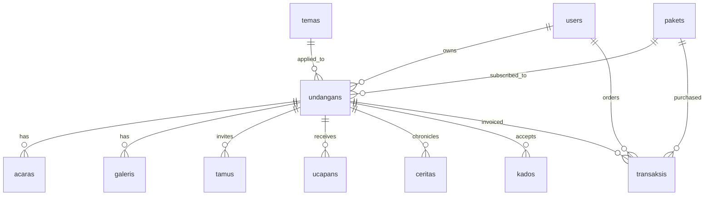

# MASTER PROJECT BLUEPRINT & CONTEXT SPECIFICATION
## Platform Undangan Digital SaaS & Concierge (Aufilla & Soraya)
**Dokumen ini adalah Single Source of Truth (SSOT) untuk pengembangan dan optimasi langsung pada codebase yang ada (Laravel 12, PHP 8.2, Blade, Tailwind CSS, MySQL).**

---

## 1. IKHTISAR SISTEM & MODEL BISNIS

### 1.1 Stack Teknologi Aktif
- **Backend:** Laravel 12, PHP 8.2, MySQL
- **Frontend:** Blade Views, Tailwind CSS, Alpine.js, Vanilla JS
- **Asset Storage:** Mandatory Zero-CDN Policy (semua pustaka JS/CSS/Font dilayani lokal dari `public/assets/`)

### 1.2 Model Bisnis & Skema Harga Dinamis (Hybrid Pricing Model)
- **Harga Dasar Paket (Base Package):** Paket langganan (Silver, Gold, Platinum) menentukan batas fitur (jumlah foto galeri, blast WA, love story, masa aktif).
- **Biaya Tambahan Tema (Theme Surcharge/Add-on):**
  - **Standard Themes (Rp 0 / Gratis):** Termasuk dalam paket dasar (misal: *Aufilla Minimalist*, *Soraya Editorial*).
  - **Premium Cultural/Traditional Themes (+Rp 25.000):** Tema bertema etnik/budaya dengan ornamen khas (misal: *Tradisional Jawa Kasunanan*, *Tradisional Minang Rumah Gadang*, *Islami Arabesque*).
  - **VIP Bespoke / 100% Custom (+Rp 75.000 – Rp 150.000):** Tema eksklusif unlisted yang dibuat khusus untuk satu klien dari nol.
- **Total Biaya Order = Harga Paket + Extra Price Tema.**

---

## 2. TAKSONOMI & SISTEM FILTER TEMA

### 2.1 Kategori Tema Utama
1. `minimalis` (Aufilla, Soraya, Modern Simple)
2. `tradisional_jawa` (Jawa Kasunanan, Joglo Klasik)
3. `tradisional_minang` (Rumah Gadang, Songket Merah)
4. `islami` (Arabesque, Kubah Elegan, Madinah)
5. `modern_floral` (Botanical, Luxury Gold)

### 2.2 Badge Tier & Flagging
- `tier`: `standard` (Rp 0), `premium` (+Rp 25k), `exclusive` (+Rp 75k - 150k)
- `is_active`: Status aktif katalog publik
- `is_unlisted`: Tema khusus privat pesanan VIP (tidak tampil di landing page, hanya bisa dipilih via admin)

### 2.3 Filter Landing Page
Filter interaktif berbasis tab kategori di Landing Page (`/` dan `/buat-undangan`) untuk memudahkan calon pengantin memilah gaya tema sesuai adat/selera.

---

## 3. STRATEGI PENANGANAN CUSTOM REQUEST KLIEN (3-LEVEL STRATEGY)

1. **Level 1: Minor Tweak (Ubah font, ganti warna background section tertentu)**
   - **Solusi:** Disimpan di kolom `undangans.custom_css` (Admin Custom CSS Injector).
   - **Dampak Kode:** Tidak menyentuh file tema.

2. **Level 2: Medium Tweak (Ganti variasi ornamen/motif)**
   - **Solusi:** Diatur via properti atau variasi class di file tema terkait.

3. **Level 3: Major Bespoke (100% Desain Baru)**
   - **Solusi:** Dibuatkan template Blade baru di `resources/views/themes/{slug-klien}/` dengan status `is_unlisted = true` di tabel `temas`.

---

## 4. STRUKTUR DATABASE (SCHEMA DICTIONARY)

### 4.1 Tabel `temas`
| Kolom | Tipe | Keterangan |
|---|---|---|
| `id` | BIGINT UNSIGNED (PK) | Auto increment |
| `name` | VARCHAR(255) | Nama tema |
| `code` | VARCHAR(255) UNIQUE | Slug folder di `resources/views/themes/{code}` |
| `category` | VARCHAR(100) | `minimalis`, `tradisional_jawa`, `tradisional_minang`, `islami`, `modern_floral` |
| `tingkatan` | ENUM('standar', 'premium', 'eksklusif') | Default: `'standar'` |
| `harga_tambahan` | DECIMAL(10,2) | Biaya ekstra add-on tema di luar paket (default: 0.00) |
| `thumbnail` | VARCHAR(255) NULLABLE | Path gambar preview katalog |
| `is_active` | BOOLEAN | Status aktif tema di sistem (default: true) |
| `is_privat` | BOOLEAN | Tema khusus pesanan VIP / unlisted (default: false) |
| `timestamps` | TIMESTAMP | `created_at`, `updated_at` |

### 4.2 Tabel `undangans`
| Kolom | Tipe | Keterangan |
|---|---|---|
| `id` | BIGINT UNSIGNED (PK) | Auto increment |
| `user_id` | BIGINT UNSIGNED (FK -> users.id) | Pemilik undangan |
| `tema_id` | BIGINT UNSIGNED (FK -> temas.id) NULL | Tema yang digunakan |
| `paket_id` | BIGINT UNSIGNED (FK -> pakets.id) NULL | Paket langganan |
| `slug` | VARCHAR(255) UNIQUE | URL publik (`/{slug}`) |
| `status` | ENUM('aktif', 'kedaluwarsa') | Default: `'aktif'` |
| `wa_send_count` | INT | Jumlah broadcast WA terkirim |
| `expired_at` | DATETIME NULLABLE | Waktu kedaluwarsa |
| `pria_nama`, `pria_nama_lengkap`, `pria_ayah`, `pria_ibu`, `pria_foto` | VARCHAR | Data pria |
| `wanita_nama`, `wanita_nama_lengkap`, `wanita_ayah`, `wanita_ibu`, `wanita_foto` | VARCHAR | Data wanita |
| `kutipan_sumber`, `kutipan_teks` | TEXT | Doa / kutipan |
| `cover_img`, `music_file` | VARCHAR | Visual cover & audio |
| `is_galeri_aktif`, `is_cerita_aktif`, `is_kado_aktif` | BOOLEAN | Switch seksi |
| `alamat_kado` | TEXT NULLABLE | Alamat fisik pengiriman kado |
| `custom_css` | TEXT NULLABLE | Injeksi CSS minor per klien |
| `timestamps` | TIMESTAMP | `created_at`, `updated_at` |

### 4.3 Tabel Terkait Lainnya
- `users`: `id, username, email, password, role ('admin', 'client', 'resepsionis'), timestamps`
- `pakets`: `id, name, price, active_days, max_wa_send, max_gallery_photos, has_love_story, can_custom_music, is_priority_support, description, timestamps`
- `acaras`: `id, undangan_id, nama_acara, tipe_acara ('akad', 'resepsi'), tgl_acara, waktu_mulai, waktu_selesai, lokasi, alamat, gmaps_link, timestamps`
- `tamus`: `id, undangan_id, nama_tamu, slug, no_whatsapp, kode_qr, is_wa_sent, waktu_hadir, timestamps`
- `ucapans`: `id, undangan_id, nama, ucapan, kehadiran ('hadir', 'tidak_hadir'), timestamps`
- `galeris`: `id, undangan_id, image_path, caption, urutan, timestamps`
- `ceritas`: `id, undangan_id, tahun, judul, cerita, urutan, timestamps`
- `kados`: `id, undangan_id, jenis ('bank', 'ewallet'), nama_bank, no_rekening, nama_pemilik, qr_image, timestamps`
- `transaksis`: `id, order_id, user_id, paket_id, undangan_id, amount, status ('pending', 'paid', 'failed', 'expired'), payment_proof, paid_at, timestamps`
- `expired_logs`: `id, executed_at, total_expired, affected_invitations (JSON), status, notes, timestamps`

---

## 5. RENCANA IMPLEMENTASI OPTIMASI CODEBASE SAAT INI

1. **Database Migration:** Tambahkan kolom `tier`, `extra_price`, dan `is_unlisted` pada tabel `temas`.
2. **Kategori Tema & Seeder:** Perbarui kategori tema yang ada (`aufilla-*` & `soraya-*` $\rightarrow$ `minimalis`), siapkan slot untuk kategori `tradisional_jawa`, `tradisional_minang`, `islami`.
3. **Filter Landing Page:** Implementasikan tab filter kategori interaktif (Alpine.js) pada katalog tema di Landing Page (`/` dan `/buat-undangan`).
4. **Kalkulasi Harga Dinamis:** Sesuaikan perhitungan total harga di registrasi mandiri dan admin (Harga Paket + Extra Price Tema).
5. **Optimasi & Refaktorisasi Bertahap:** Pisahkan validasi controller yang panjang ke `FormRequest` class tanpa mengubah struktur view Blade yang sudah berjalan.
